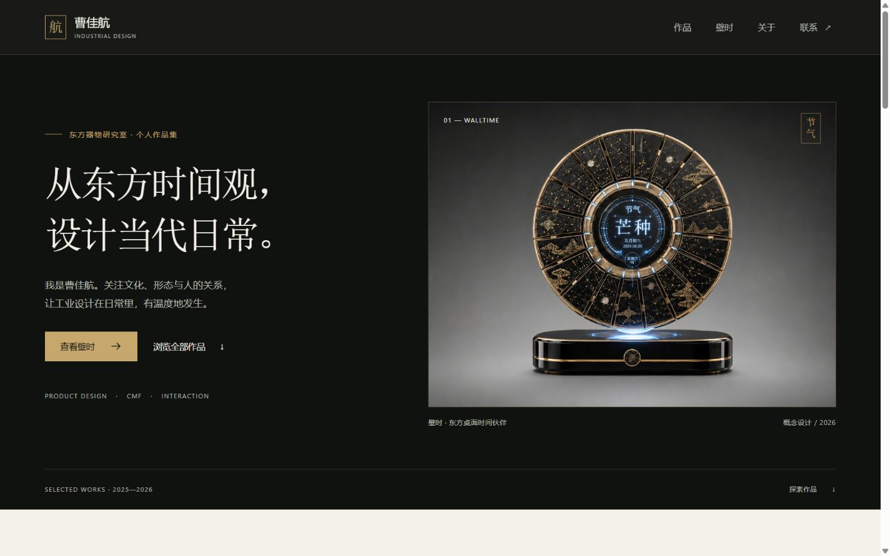

# 项目基础验收

2026-10-04，Task 1。新目录、独立 Git 分支和固定 Node 22.23.3；Node 官方 SHA-256 已核验。本机依赖缓存、安装日志、构建与截图均在 D 盘。原仓库的 HEAD 及既存 `.netlify/` 状态记录于 `docs/old-site-baseline.json`。

路径测试先因缺少 `lib/site-path.js` 失败，实现后 10 项通过。Next 16.3.8 静态首页构建成功，HTML 包含作者、主张、八件作品、原生媒体和联系入口。

CUA 实际设置 1440×900 与 390×844；Windows 滚动条下内容宽分别为1425px、375px。手机主图加载完成、横向内容宽不超出视口。点击「查看壁时」到达 `#walltime`，作品起点距顶部108px。首屏没有加载遮罩。

此时四个案例入口结构已存在，案例页在 Task 2 完成；本记录不表示整站已经上线。

依赖核验发现原基线 Sharp 0.34.5、Vitest 4.1.9 的已公开通告，升级到 Sharp 0.35.5 / Vitest 4.1.11 后再次审计。首次 npm 10.9.9 在可选 peer 解析阶段崩溃，改用现有 npm 11.13.0 CLI 在 D 盘安装；没有升级或修改全局安装。
