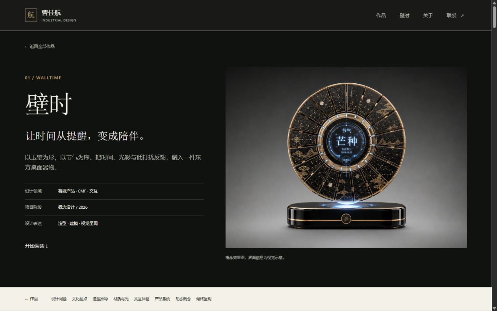
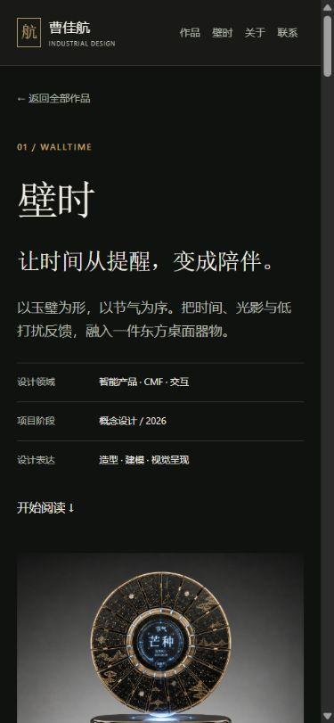

# 第一轮 · 内容与视觉身份

日期：2026-10-04。实际版本为基础首页之后新增四个独立案例、24项可追溯素材记录与原图入口。本轮不把第二轮交互提前算作已完成。

采用的方法来自 frontend-design 的明确视觉立场和 apple-design 的产品叙事：以壁时为主角，墨漆黑与暖纸色组织深浅章节，减少泛用的模板文案。针对本项目的改写提示词在 `docs/references/三轮优化提示词.md`；来源与许可见第三方记录。

实际改动：壁时八章；散热风扇三章；磁吸药盒三章；涪陵包装四章；首页保留四个建模练习。案例提供返回目录、下一件作品、原生原图链接与视频入口。造型推导使用存在的 `assets/walltime-process.jpg`，修正原站错误路径的迁移问题。

依据：原 `data/projects.js`、`WalltimeCase.jsx`、作者已有渲染与展板。正文不新增调研人数、奖项、量产或测试结果。工艺采用 CMF 视觉提案的准确表述；原视频、水印和概念界面说明保留。

素材：22张展示图及独立原件、原MP4和原简历，源哈希保持一致。总展示图片3,912,948字节，最大单个原件5,113,074字节；这是文件体积，不是加载速度评分。详见 `docs/asset-manifest.json`。

验证：路径10项测试通过；静态构建生成首页与四案例。CUA 实际直接访问并刷新四页，标题、章节与封面匹配，无桌面横向溢出；首页→壁时→案例、四案例→目录路径走通。手机壁时内容宽375px与视口一致。HTTP检测：首页、四案例、简历、原图和推导图200，未知案例404。壁时导出HTML有10个图片节点与原生原图链接；初始没有video元素，正文与封面不依赖播放。

用户在初版提出「高级一点」。后续重点：更强的产品占比、自托管且有许可的中文标题字体、手机图像优先、克制的产品视差，以及更清晰的菜单与画廊。
